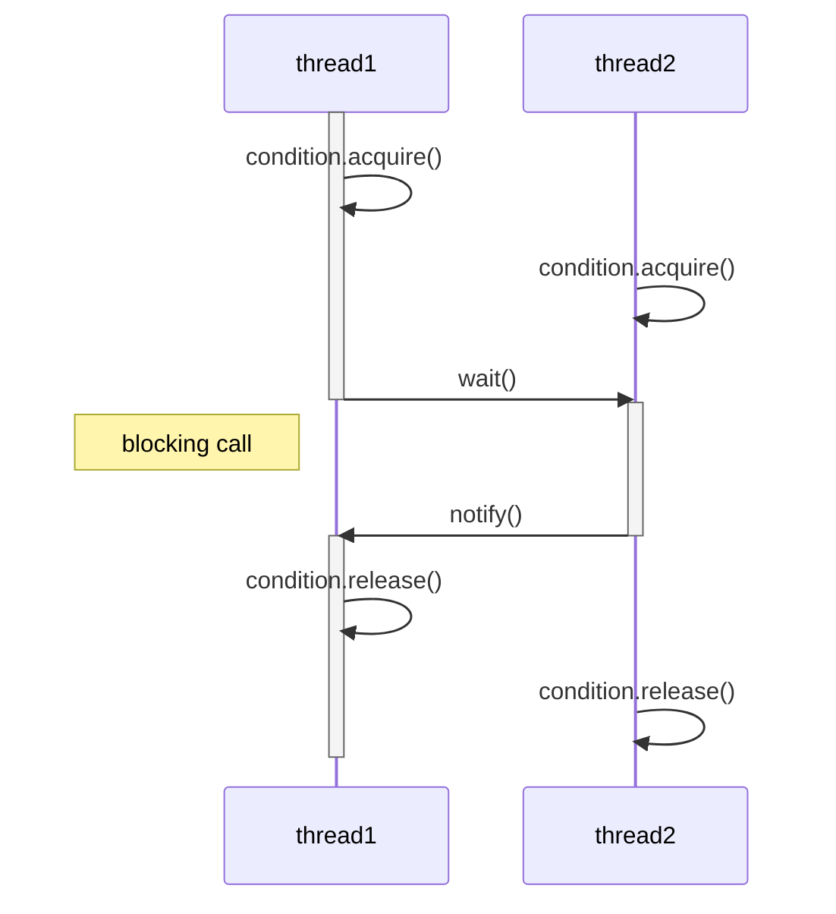

# thrading.lock

`race condition` [^1] 를 예방할 때 사용한다.

[^1]:여러 쓰레드에서 구문을 동시에 실행해서 의도치 않은 연산이 일어나는 것을 예방한다.)

lock은 여러 쓰레드 중 하나만이 소유할 수 있는 객체다. 

한- 쓰레드에서 `acquire`메서드로 lock을 취득하면 다른 쓰레드에서는 acquire를 호출해도 lock을 얻을 수 없고, lock을 보유한 쓰레드가 `release`로 해제하기 전까지 기다려야 한다. (blocking call)

# threading.condition

다른 쓰레드로부터 알림을 받아야 할 때 사용할 수 있다.

condition은 `acquire`, `release`, `notify`, `wait` 메소드가 있다. wait()을 호출한 쓰레드는 block되며 다른 쓰레드에서 `notify`나 `notify_all`을 호출해줘야 해제된다.



wait 중인 thread가 여러개면 notify_all을 사용해야 모두 해제된다.

# threading.barrier

여러 쓰레드가 모일 때까지 기다렸다가 동시에 해제할 때 사용하는 객체.

`wait`을 호출한 쓰레드들은 block 상태로 대기하다가 대기 중인 쓰레드 수가 지정 수에 도달하면 남은 파티 수를 정수로 반환한다. (마지막 쓰레드는 0을 반환한다.)

```python

# configure a barrier with a default timeout
barrier = threading.Barrier(10, timeout=5)
```

대기할 수와 시간 제한은 **생성할 때** 지정해야한다.

`timeout`이 발생하면 대기 중인 모든 쓰레드에서 `BrokenBarrierError`가 발생한다.


```python

# wait on the barrier for all other threads to arrive

try:

    barrier.wait()

except BrokenBarrierError:

    # ...
```
