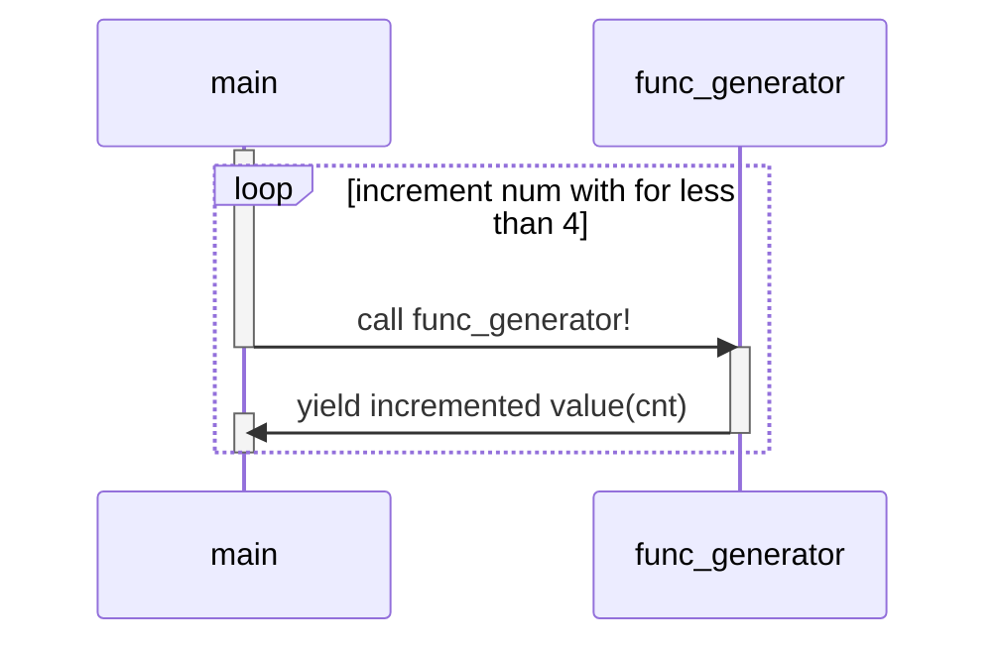

# generator

제러네이터는 `yield` 표현식을 사용하는 서브루틴이다.

서브루틴이 return을 만나거나 마지막에 도달하면 종료되는 것에 비해, 제너레이터는 중도에 `yield`문을 만나면 실행이 중단되며 외부에서 `next`로 재개될 수 있다.

```python

print("1. 제너레이터 생성")
# 제러네이터 정의
def func_generator():
	for cnt in range(9):
	yield num

# 제너레이터 반복자 생성
generator_object = func_generator()
print(generator_object, end="\n\n")

print("2. next로 제너레이터 반복자 실행")
for num in range(4):
	# next 메서드를 실행할 때마다 generator_object의 카운트 증가
	print(next(generator_object))
	print()

  

print("3. range-based-for-loop로 반복자 실행")
for num in generator_object:
	# 앞서 진행된 정도 다음에서 마저 실행
	print(num)
```

```bash
bure@burepool:~/practice$  cd /home/bure/practice ; /usr/bin/env /bin/python3 /home/bure/.vscode/extensions/ms-python.debugpy-2024.0.0-linux-x64/bundled/libs/debugpy/adapter/../../debugpy/launcher 36731 -- /home/bure/practice/python/generator/generator.py 
제너레이터 생성
<generator object func_generator at 0x73c613db6730>

제너레이터 실행
0
1
2
3
```




# asyncio generator

앞서 설명한 함수 제너레이터 말고 `async generator`도 있다.

비동기 제너레이터는 `awaitable`을 반환한다.

## 차이

| 항목| generator| async generator|:
| --- | --- | --- |
| 실행 메서드| next()| anext()|
| loop| for|async for |
| 반환 값 | 그냥 값 반환 | awaitable 객체를 반환|

## 예제


```python

import asyncio  

# 제러네이터 객체 생성
print("1. 비동기 제너레이터 생성")

async def async_generator():
	for num in range(9):
		await asyncio.sleep(1)
		yield num

  

generator_object = async_generator()
print(generator_object, end="\n\n")

  
  

async def main():
	print("2. anext로 비동기 제너레이터 반복자 실행")
	for num in range(4):
		# next 메서드를 실행할 때마다 generator_object의 카운트 증가
		ret = anext(generator_object)
		print( await ret)

  

	print("3. range-based-loop로 반복자 실행")
	async for num in generator_object:
		# num에는 yield된 결과물이 들어간다. (await로 대기한 결과가 들어감)
		print(num)
	print()

  

	print("4. list-comprehension으로 async for를 한줄로 표현")
	results = [item async for item in async_generator()]
	# report results
	print(results)

asyncio.run(main())
```


