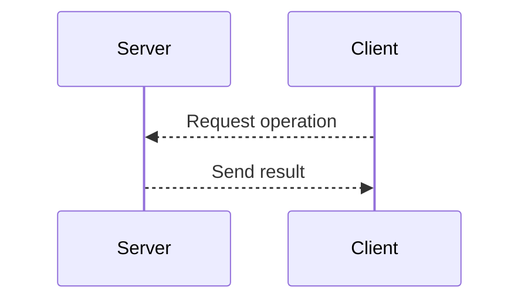
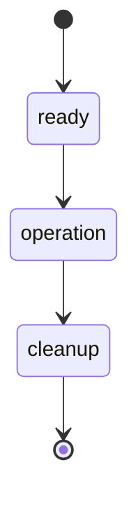

# Overview
`mermaid`는 마크다운에서 다이어그램을 그릴 수 있게 해주는 포맷이다.

자바스크립트 기반이며 랜더링하는 대상에서 모듈을 지원해야 그릴 수 있다.

사용하는 방식은

백틱 세개를 써 코드블록을 만들고, \`\`\` 뒤에 뒤에 mermaid 를 붙인다.
바로 두번째 줄(``` 밑) 그리려는 다이어그램 종류를 `camelcase`로 선언해주면 된다.


관련 문법은 [mermaid document](https://mermaid.js.org/syntax/stateDiagram.html)를 참고하면 된다.

## 예시1) 시퀀스 다이어그램

컴포넌트간 흐름을 순서대로 보여줄때 사용하는 시퀀스 다이어그램을 한번 그려보자


## 예시2) State 다이어그램

클래스 다이어그램도 나타낼 수도 있다


