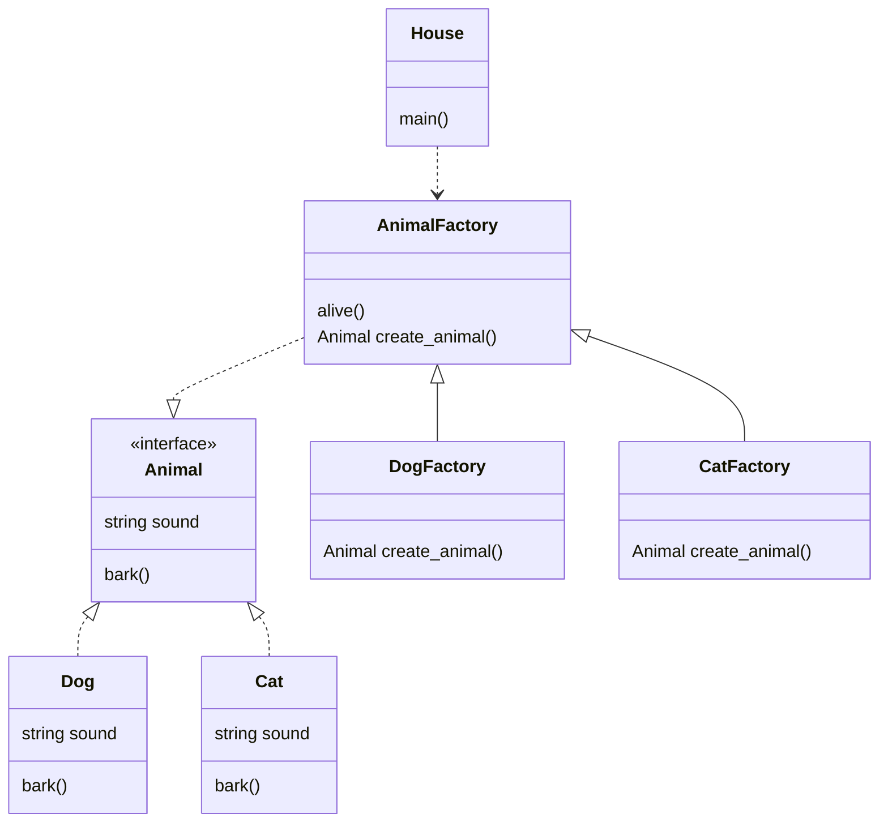
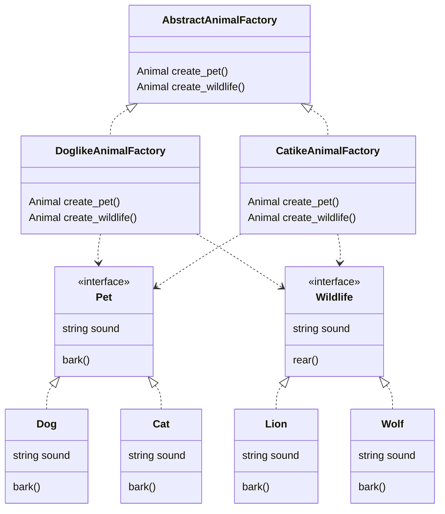

# 팩토리 메소드와의 차이

팩토리 메소드는 같은 인터페이스의 여러 `production` 클래스 인스턴스를 반환하는 클래스를 구현하는 패턴이다.

추상 팩토리 메서드 패턴은 팩토리 메서드 패턴에서 인터페이스가 하나 더 추가된다.
팩토리들의 인터페이스를 정의해서 팩토리들이 생산해야할 production들을 여러개 규정한다.

팩토리 메서드 : 팩토리가 생성할 production의 멤버 목록을 정의한다.
추상 팩토리 메서드 : 팩토리가 생성할 `production` 클래스를 정의하고, `production` 별로 가져야할 멤버 목록을 정의한다.

``

- `factory method class`인 `AnimalFactory`는 `animal` 이라는 `production` 이라면 모두 적용할 수 있는 `alive()` 라는 메소드를 갖고 있음.
- `factory method class`를 상속하는 `DogFactory` 와 `CatFactory` 는 `alive` 상속받아서 사용할 수 있지만 내부에서 Dog와 Cat이라는 다른 `production`을 사용해 실행함.
- `Caller` 인 `House`는 `AnimalFactory`의 서브클래스 중 필요한 팩토리를 가져오면 `alive()` `production`에 상관없이 동작할 수 있음.

- `production`이 2종류로 늘어남 (Pet, Wildlife)
- `production` 인스턴스를 반환하던 `FactoryMethod`는 본인의 성격에 맞는 `production`을 종류 별로 생성함. (`DoglikeAnimalFactory` 는 개과의 `Pet`과 `Wildlife`를 생성, `CatlikeAnimalFactory`는 고양이과의 `Pet`과 `Wildlife`를 생성
- 
