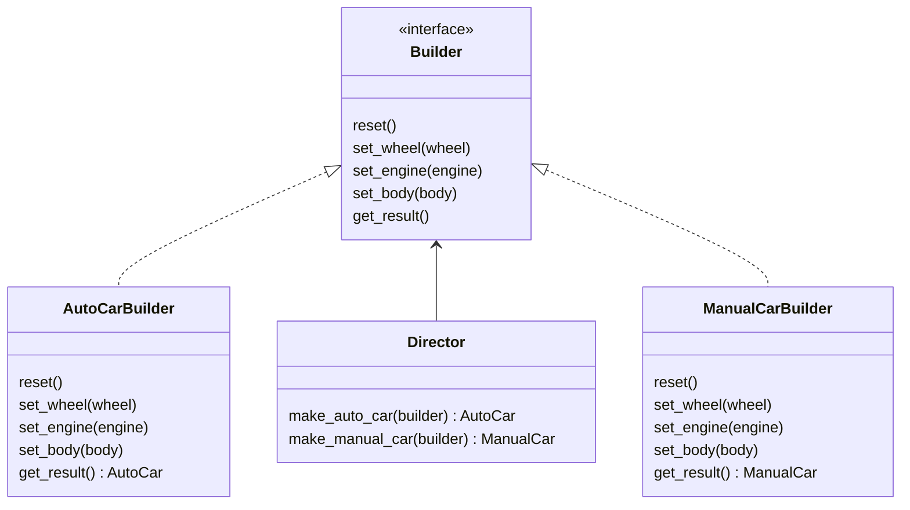

# 개요

## Builder pattern 이란

클래스의 생성자 로직을 메소드로 실행하도록 구성하는 패턴이다.

클래스의 생성 로직을 외부의 Builder가 제어하도록 한다.

생성자의 매개변수가 부담스럽게 많아질 때 사용할 수 있다.

## Builder pattern의 구성요소

`production` : 클라이언트가 요구하는 실제 클레스
`builder` : `production`를 구성할 수 있는 인터페이스를 제공.
`director` : 필요한 구성이 갖춰진 `production`을 만들도록 `builder`에게 지시하는 클래스

