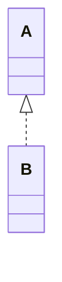
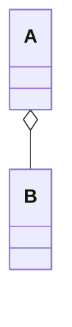
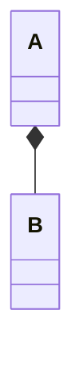
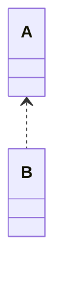

# 클래스 관계 종류

## 상속,  일반화 (Generalization)

일반화는 일반적인 일반적인 클래스와 더 상세한 클래스 간의 관계다.

상세한 클래스의 인스턴스들은 간접적으로 일반적인 클래스의 인스턴스가 될 수도 있다. 그러므로, 상세한 클래스는 일반적인 클래스의 기능을 상속한다.

- is-a 관계라고도 한다.
- 추상 클래스의 이름은 이텔릭체로 표기한다

   
## 집합 (Aggregation)

- B는 `part of` A의 관계로 표현한다.
- A에서 B는 독립된 라이프사이클을 가진다.

## 합성 (Composition)

합성은 특별한 집합 관계로, `B`가 `A` 없이는 존재할 수 없는 관계를 표현한다.

## 실체화 (Realization)

인터페이스와 구현 클래스 간의 관계다.

## 의존 (Dependency)

클래스와 메소드 파라미터로 전달받는 클래스 간의 관계다.

`Aggregation` / `Composition`과 다르게 필드로 갖지 않는다.

의존관계라고 한다.

Reference
https://www.visual-paradigm.com/guide/uml-unified-modeling-language/uml-class-diagram-tutorial/

[mermaid, class diagram](https://mermaid.js.org/syntax/classDiagram.html)

